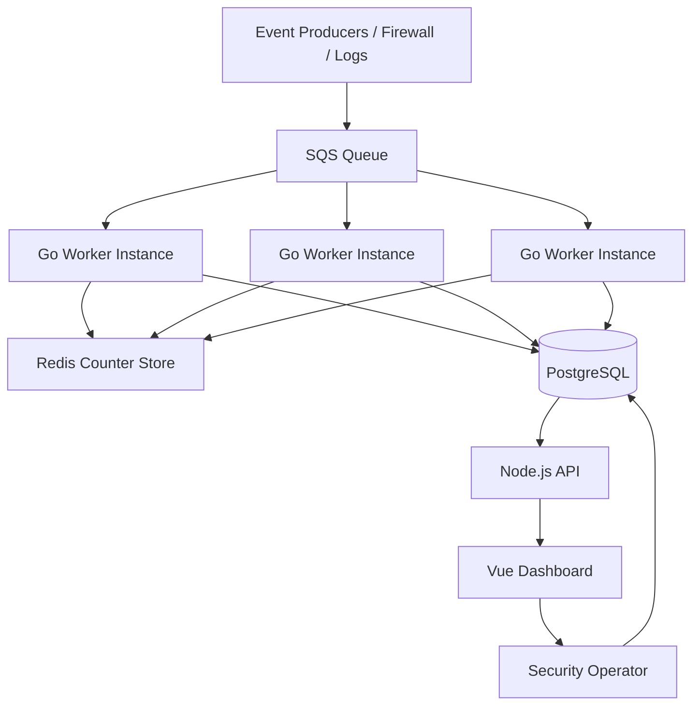

# High Level Design (HLD)

## 1. Objective

The system detects suspicious patterns in IPSec authentication failures and surfaces them as actionable security alerts. It is designed for operational visibility, alerting, and investigation of brute-force or repeated negotiation failures from a single source IP.

The system is not just a dashboard; it is an event-driven security detection pipeline that turns low-level firewall data into structured threat intelligence.

## 2. Business Problem

Repeated IPSec negotiations failing from one source IP often indicate:

- brute-force authentication attempts
- malicious scanning activity
- misconfiguration or repeated failed handshakes
- automated reconnaissance

Security teams need to quickly identify when a source is behaving anomalously and track whether the incident has been handled.

## 3. High-Level Goals

### Functional Goals
- Receive IPSec event payloads from upstream sources
- Process them asynchronously
- Detect abnormal behavior by source IP
- Persist anomaly records with metadata
- Provide a dashboard for investigation and resolution

### Non-Functional Goals
- Low-latency detection path
- Scalable worker processing
- High availability for the API and dashboard
- Durable storage for anomaly records
- Separation of hot-path state from long-term storage
- Operational resilience using queues and retries

## 4. System Context

The system operates as a data-processing pipeline with three main layers:

1. Event ingestion
2. Detection and enrichment
3. Storage and presentation

The workload is asynchronous by design. The event producers do not block on database writes or UI operations.

## 5. Core Architecture

## 6. Component Overview

### A. Event Producers
These are upstream systems that emit IPSec events. They may include firewall logs, security appliances, or integration services.

Responsibilities:
- generate structured JSON events
- send event to the queue
- remain decoupled from downstream processing

### B. AWS SQS
SQS acts as the durable ingestion layer.

Why it is used:
- decouples producer and consumer
- supports buffering during spikes
- avoids direct coupling to downstream logic
- improves resilience and scaling

Characteristics:
- asynchronous messaging
- queue-based reliability
- long polling for lower cost and better throughput

### C. Go Worker
The Go worker is the core detection engine.

Responsibilities:
- poll SQS
- parse each message
- evaluate whether it is relevant
- increment per-IP counter in Redis
- trigger alert if threshold is crossed
- write anomaly into PostgreSQL
- acknowledge the SQS message

This is the component that embodies the actual detection logic.

### D. Redis
Redis is used for short-lived, high-speed counters.

Why it is used:
- low-latency access
- counting per IP in a rolling window is cheap and efficient
- avoids expensive DB operations for every event

The key represents a source IP and is time-bounded.

### E. PostgreSQL
PostgreSQL stores durable anomaly records.

Why it is used:
- structured querying
- historical investigations
- analytics and reporting
- audit trail for security events

### F. Node API
The API exposes application data to the frontend and other clients.

Responsibilities:
- expose queries for anomalies and stats
- validate input parameters
- integrate with Postgres
- handle update requests like marking incidents resolved

### G. Vue Dashboard
The frontend gives operators a live view of anomalies and their status.

Responsibilities:
- fetch current anomalies
- highlight active threats
- allow event review and resolution

## 7. Detection Model

The design uses a rate-based anomaly model:

- Track failed IKE negotiations for a source IP
- Use a sliding window of 60 seconds
- Maintain a threshold of 50 failures
- Trigger an anomaly when threshold is exceeded

This is effectively a threshold-based abuse detection model.

### Example

If 50 failed negotiation events are seen from `203.0.113.7` within 60 seconds:
- increment Redis counter for that IP
- when it reaches 50, insert a `BRUTE_FORCE_IKE` anomaly
- store raw event payloads for evidence
- delete the message from SQS after success

## 8. Data Flow

### Happy Path
1. Event enters SQS
2. Worker reads message
3. JSON is unmarshalled
4. Message is checked for action type
5. For matching failures, Redis counter is incremented
6. Threshold is evaluated
7. If triggered, anomaly is inserted into PostgreSQL
8. Message is deleted from SQS

### Error Handling Path
- invalid JSON: log and discard
- action mismatch: discard and delete
- Redis failure: log and stop processing
- DB insert failure: do not delete message; allow retry

This approach is important because it preserves data integrity and prevents silent loss.

## 9. Reliability and Fault Tolerance

### Queue-based reliability
The queue acts as a buffer between upstream producers and the worker. If detection is temporarily down, events remain queued.

### Retry semantics
If a DB write fails, the message is left in the queue so it can be retried later.

### Stateful detection in Redis
Redis handles ephemeral detection state efficiently, reducing the load on the database.

### Separation of concerns
Each component can fail independently without taking the whole system down.

## 10. Scalability Strategy

The design scales via horizontal scale-out:

- multiple worker replicas can consume the same SQS queue
- Redis can be clustered or managed in production
- Postgres can use read replicas or higher capacity instances
- the API can also scale behind a load balancer

This supports increased threat volume and operational load without redesigning the application.

## 11. Security Design

The design acknowledges security concerns such as:

- storing raw event payloads for evidence
- validating API requests
- controlling access to the dashboard and API
- keeping secrets via Kubernetes Secrets and environment variables

In production, a hardened version would also add:

- authentication and authorization
- rate limiting
- WAF / API gateway controls
- audit trails
- proper secret management

## 12. Operational Considerations

### Monitoring
- worker logs for detected anomalies
- queue depth monitoring
- Redis memory usage monitoring
- Postgres query performance monitoring
- API health checks

### Deployment
The project includes:
- Docker Compose for local development
- Kubernetes manifests for deployment
- Terraform for cloud provisioning

### Health checks
The API includes `/healthz`, which is used for readiness and liveness checks in Kubernetes.

## 13. Trade-offs

### Benefits
- asynchronous processing
- good scalability
- efficient anomaly scoring
- resilient queue-based architecture
- simpler operational debugging

### Trade-offs
- eventual consistency between queue and persistence
- at-least-once processing behavior
- Redis state is not durable by itself
- threshold logic can be tuned and may require adjustment for real traffic

## 14. Why This Design Is Interview-Friendly

This system demonstrates several classic engineering themes:

- event-driven architecture
- distributed systems principles
- queue-based decoupling
- hot-path vs cold-path data separation
- concurrency in Go
- cloud-native deployment patterns
- security analytics using real-time detection logic

Interviewers typically look for the candidate to explain:

- why SQS is chosen
- why Redis is chosen for counting
- why Postgres is used for anomalies
- how the worker handles concurrency and retries
- how the system scales horizontally
- how data moves across the pipeline

## 15. Summary

This project is a practical distributed security detection system: an asynchronous pipeline that converts incoming IPSec event data into actionable anomaly alerts. The architecture balances speed, durability, and operational visibility, while keeping responsibilities cleanly separated across services.

In interview terms, it is a strong example of:

- queue-driven event processing
- Go worker implementation
- in-memory detection logic
- persistent analytics storage
- production-ready cloud deployment patterns
