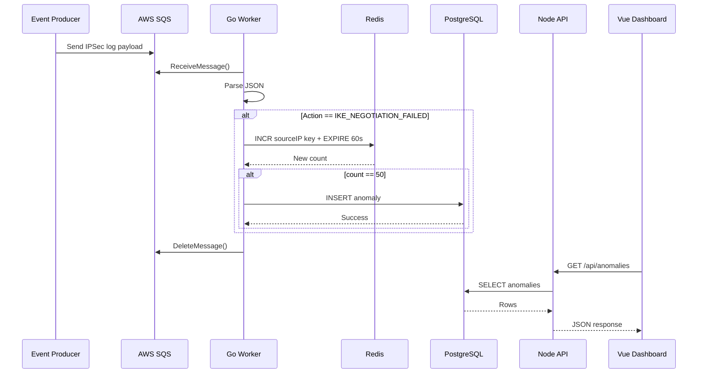

# Low Level Design (LLD)

## 1. Purpose

This document explains the internal design and implementation details of the IPSec Anomaly Detection project at the component level.

## 2. Module Breakdown

### 2.1 Worker Module
Location: `worker/`

#### Package Layout
- `cmd/worker/main.go` — application entry point
- `internal/aws/sqs.go` — SQS wrapper
- `internal/cache/redis.go` — Redis counter logic
- `internal/db/postgres.go` — PostgreSQL data access
- `internal/models/models.go` — DTOs and config
- `internal/processor/processor.go` — anomaly detection flow

#### Main Flow
`main.go` does the following:

1. Builds a `context.Context`
2. Loads config from environment variables
3. Initializes SQS client
4. Initializes Redis client
5. Initializes Postgres store
6. Creates a `Processor`
7. Calls `proc.Start(ctx)`

### 2.2 API Module
Location: `api/src/`

#### Package Layout
- `server.js` — Express app bootstrap
- `routes/anomalyRoutes.js` — route registration
- `controllers/anomalyController.js` — HTTP request handling
- `services/anomalyService.js` — DB query logic
- `middlewares/security.js` — headers and CORS
- `middlewares/rateLimiter.js` — rate limiting
- `middlewares/errorHandler.js` — centralized error handling

### 2.3 Web Module
Location: `web/src/`

#### Package Layout
- `App.vue` — app shell
- `views/Dashboard.vue` — main dashboard page
- `composables/useAnomalies.ts` — fetch and resolve logic
- `components/AnomalyTable.vue` — anomaly table presentation

## 3. Data Model

### IPSecLog
Defined in `worker/internal/models/models.go`

```go
type IPSecLog struct {
    Action   string `json:"action"`
    SourceIP string `json:"source_ip"`
}
```

This represents the expected event format used by the worker.

### Config
```go
type Config struct {
    QueueURL    string
    RedisURL    string
    DatabaseURL string
}
```

### Anomaly Record
In PostgreSQL, the table is:

```sql
CREATE TABLE ipsec_anomalies (
    id UUID PRIMARY KEY DEFAULT gen_random_uuid(),
    timestamp TIMESTAMPTZ DEFAULT NOW(),
    source_ip VARCHAR(45) NOT NULL,
    threat_type VARCHAR(50) NOT NULL,
    severity INT NOT NULL,
    raw_payload JSONB NOT NULL,
    resolved BOOLEAN DEFAULT FALSE
);
```

## 4. Low-Level Worker Design

### 4.1 SQS Client
File: `worker/internal/aws/sqs.go`

Responsibilities:
- initialize AWS SDK client using default config
- receive messages from a configured queue
- delete processed messages

Methods:
- `NewSQSClient(ctx, queueURL)`
- `ReceiveMessages(ctx, maxMessages, waitTime)`
- `DeleteMessage(ctx, receiptHandle)`

Behavior:
- uses `ReceiveMessageInput`
- requests both message count and wait time
- uses `DeleteMessageInput` to acknowledge processing

### 4.2 Redis Cache
File: `worker/internal/cache/redis.go`

Responsibilities:
- create a Redis client
- increment per-IP counters
- set expiration on the key

Method:
- `IncrementAndExpire(ctx, key, window)`

Implementation details:
- uses a Redis pipeline
- calls `INCR` and `EXPIRE` together
- returns the new count

This is used to count failures within a specific time period.

### 4.3 PostgreSQL Store
File: `worker/internal/db/postgres.go`

Responsibilities:
- connect to Postgres
- validate DB reachability using `Ping()`
- insert stored anomalies
- close the database connection

Method:
- `InsertAnomaly(ctx, sourceIP, threatType, rawPayload, severity)`

SQL behavior:
```sql
INSERT INTO ipsec_anomalies (source_ip, threat_type, severity, raw_payload)
VALUES ($1, $2, $3, $4)
```

### 4.4 Processor
File: `worker/internal/processor/processor.go`

Main structure:

```go
type Processor struct {
    sqs   *aws.SQSClient
    cache *cache.Cache
    db    *db.Store
}
```

Constants:
- `Threshold = 50`
- `WindowSeconds = 60 * time.Second`

#### Start loop
```go
for {
    messages, err := p.sqs.ReceiveMessages(ctx, 10, 20)
    if err != nil {
        log.Printf("Error fetching messages: %v", err)
        time.Sleep(5 * time.Second)
        continue
    }

    if len(messages) == 0 {
        continue
    }

    var wg sync.WaitGroup
    for _, msg := range messages {
        wg.Add(1)
        go func(m types.Message) {
            defer wg.Done()
            p.handleMessage(ctx, m)
        }(msg)
    }

    wg.Wait()
}
```

This enables concurrent processing of queue messages.

#### Message handling
```go
func (p *Processor) handleMessage(ctx context.Context, msg types.Message) {
    var ipsecLog models.IPSecLog

    if err := json.Unmarshal([]byte(*msg.Body), &ipsecLog); err != nil {
        log.Printf("Invalid JSON: %v", err)
        return
    }

    if ipsecLog.Action != "IKE_NEGOTIATION_FAILED" {
        p.sqs.DeleteMessage(ctx, msg.ReceiptHandle)
        return
    }

    redisKey := "ipsec:anomaly:" + ipsecLog.SourceIP

    count, err := p.cache.IncrementAndExpire(ctx, redisKey, WindowSeconds)
    if err != nil {
        log.Printf("Cache error for %s: %v", ipsecLog.SourceIP, err)
        return
    }

    if count == Threshold {
        err := p.db.InsertAnomaly(ctx, ipsecLog.SourceIP, "BRUTE_FORCE_IKE", *msg.Body, 8)
        if err != nil {
            log.Printf("DB insert failed: %v", err)
            return
        }
    }

    p.sqs.DeleteMessage(ctx, msg.ReceiptHandle)
}
```

## 5. API Low-Level Design

### 5.1 Route Layer
`api/src/routes/anomalyRoutes.js`

Routes:
- `GET /anomalies`
- `GET /anomalies/stats`
- `PATCH /anomalies/:id/resolve`

### 5.2 Controller Layer
`api/src/controllers/anomalyController.js`

Responsibilities:
- validate request input using Zod
- invoke service methods
- map errors to HTTP responses

Example validation:
- `limit` must be between 1 and 100
- `offset` must be >= 0
- `sourceIp` validates as an IP string
- `resolved` is parsed from `"true"` or `"false"`

### 5.3 Service Layer
`api/src/services/anomalyService.js`

Main functions:
- `getAnomalies({ limit, offset, sourceIp, resolved })`
- `getAnomalyStats()`
- `resolveAnomaly(id)`

These build SQL queries dynamically using input filters and then execute them through the database pool.

## 6. Web Low-Level Design

### 6.1 Composable
`web/src/composables/useAnomalies.ts`

This provides state and actions:
- `anomalies`: list of anomalies
- `loading`: UI loading state
- `error`: error state
- `fetchAnomalies()`
- `resolveAnomaly(id)`

It uses `fetch()` to call the API and updates local state optimistically.

### 6.2 Dashboard View
`web/src/views/Dashboard.vue`

Responsibilities:
- mount the dashboard
- fetch the first dataset on page load
- render table view
- trigger manual refresh

### 6.3 Table Component
`web/src/components/AnomalyTable.vue`

Responsibilities:
- render anomaly list as a table
- show source IP, threat type, severity, timestamp, and resolved status
- provide action to resolve a row

## 7. Sequence Flow



## 8. Failure Modes and Handling

### Invalid JSON
- logged
- ignored
- message is not retried by the business logic

### Non-target actions
- message is deleted
- not considered an anomaly event

### Redis failure
- log error
- abort current processing
- do not move forward with anomaly creation

### Database failure
- log failure
- do not delete SQS message
- allows later retry and preserves data

## 9. Deployment-Level Design

### Local Development
- Docker Compose sets up:
  - Redis
  - PostgreSQL

### Kubernetes Production
- `worker-deployment.yaml` deploys multiple worker replicas
- `api-deployment.yaml` deploys the API service
- `configmaps.yaml` stores environment configuration
- `secrets.yaml` stores credentials

### Terraform Cloud Setup
- provisions VPC and subnets
- creates SQS queue
- creates ElastiCache Redis cluster
- creates Aurora PostgreSQL database
- creates EKS cluster

## 10. Key Design Decisions

### Why Go for worker?
- small footprint
- excellent concurrency with goroutines
- fast execution for queue processing
- easy to deploy in containers

### Why Redis?
- fast sliding-window counter
- ideal for detecting bursts in a short interval

### Why PostgreSQL?
- durable storage of security records
- supports historical analytics and incident review

### Why SQS?
- decouples producers and workers
- protects the system from traffic spikes
- allows asynchronous processing

## 11. Improvement Opportunities

This project is a strong prototype and could be enhanced with:

- DLQ (Dead Letter Queue) for poison messages
- KEDA-based autoscaling on queue depth
- metrics with Prometheus/Grafana
- observability with OpenTelemetry
- authentication for API endpoints
- stronger config validation and environment management
- idempotency protection for duplicate messages

## 12. Summary

The low-level design shows a clean layered architecture:

- queue for ingestion
- worker for detection logic
- Redis for fast counters
- Postgres for durable records
- API for querying
- UI for visualization and resolution

This structure is easy to explain in interviews because it reflects real-world distributed systems patterns, modern cloud deployment, and a practical security use-case.
